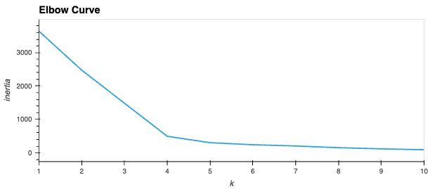
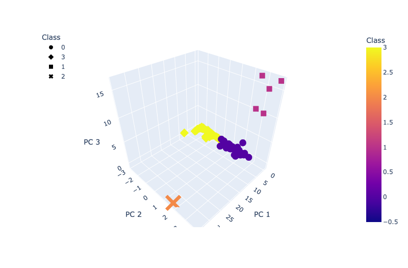
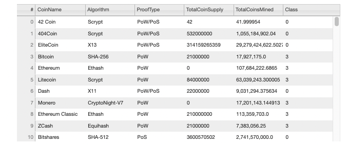
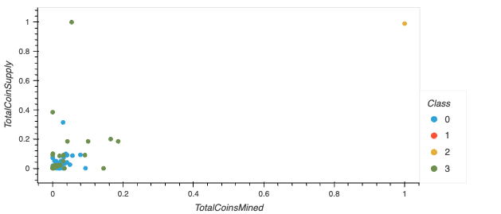

# Cryptocurrencies

## Overview
This project analyzes cryptocurrency data to look for trends for future investments. Since the final output was unknown, unsupervised machine learning was used to cluster the cryptocurrencies. 

## Resources
- Datasource: [CryptoCompare](https://min-api.cryptocompare.com/data/all/coinlist)
- Python
- Pandas
- HV Plot
- Plotly Express
- SKLearn

### Processing Data
First I reviewed the raw data and removed any coins that were not actively trading. I also removed all null values to prepare for the ML modeling. I used the get_dummies() function to creating variables for the text features(Algorithm and ProofType) and standardized features.

### Reducing Data Dimensions Using PCA
Once the data was cleaned, I reduced the dimensions to 3 principal components.

### Clustering Cryptocurrencies Using K-means
To find the k value, I created an elbow curve with hvPlot. This shows the best value for K = 4.

With this K-value, I was able to make predictions for the clusters.

### Visualizing Cryptocurrencies
This 3D Scatter Plot shows all three clusters. When hovering over a data point, you'll see the Coin Name and Algorithm type.

Once the data was clustered, I saved a table with each curriencie's classification.

Lastly, this 2D Scatter Plot shows the total Coins Mined vs. Total Coin supply by class.

